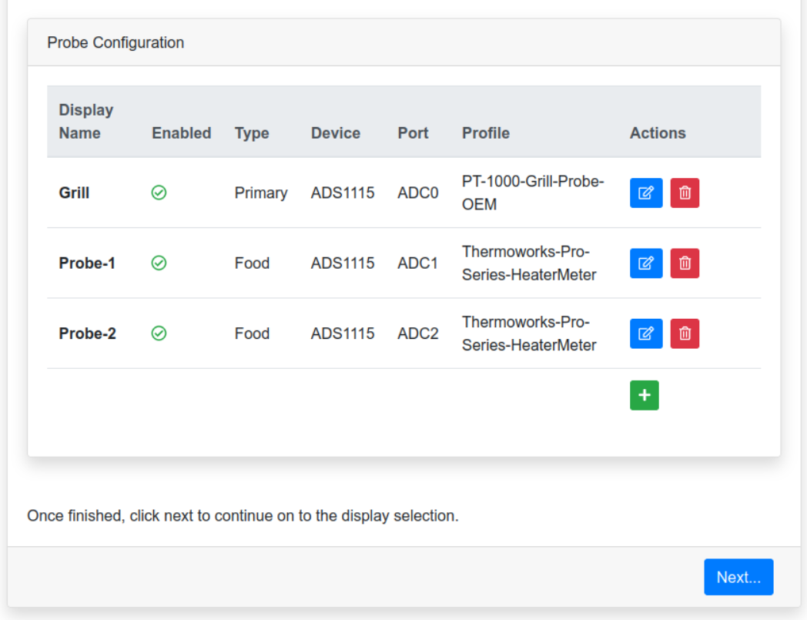
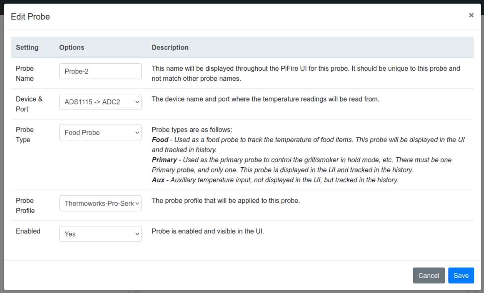
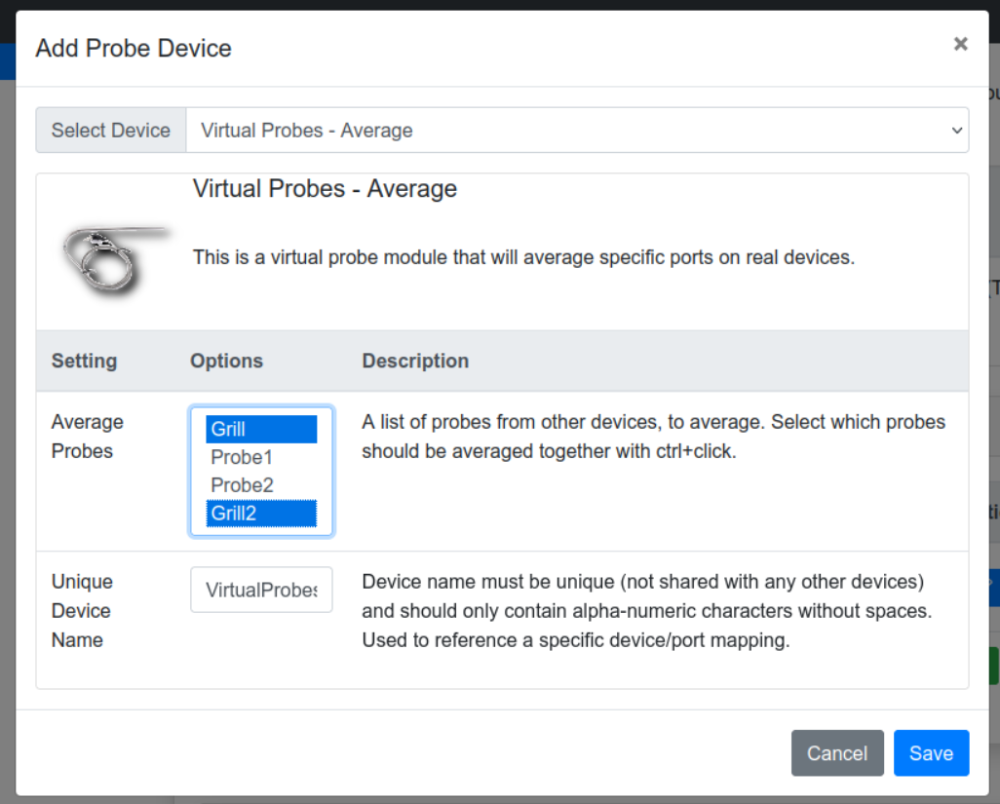

## Software Installation

### TL;DR Let's Install this thing! 

It's recommended that you read through the documentation below, or watch the setup video. But if you want to just jump right in, then run the below command on your Raspberry Pi to get started.  

```bash
$ curl https://raw.githubusercontent.com/nebhead/pifire/main/auto-install/install.sh | bash
```

### Basic Installation Video

It's recommended to watch the video and follow along with these steps below, to get you up and running quickly.  

```note
This install video is for previous versions, but is still generally relevant.
```

[](https://youtu.be/Bena9Yq00VM)

### Raspberry Pi - Flash and Prepare SD Card

#### **Recommended Method:** Using the Raspberry Pi Imager (v1.7.x +)
With the updates to the Raspberry Pi Imager, you can quickly and easily configure and flash your SD Card in just minutes, all in one tool.

1. Open the Raspberry Pi Imager
2. Select the Raspberry Pi OS
	- Under Raspberry Pi OS (other), select the Raspberry Pi OS Lite (32-Bit) (Note that the installer has been updated to support Bookworm)
3. Select the Storage Device (SD Card)
4. Select the 'Cog' icon in the lower right corner
	- Select Hostname (enter: pifire)
	- Select SSH (password authentication), and enter a password (keep username as 'pi')
	- Select Configure Wifi, and enter in your network SSID and password.  Also, select your Wifi country i.e. 'US' for the United States
	- Select Locale Settings, and configure your timezone and keyboard layout
	- Click Save
5. Select Write and wait for the imager to write to the SD Card

#### PiFire OS Option

Github user @calonmerc has created a PiFire OS image that can be flashed and used without the below installation necessary. Just flash, boot, configure and go!  

Start [here](https://github.com/calonmerc/PiFireOS) for the image download and detailed instructions on how to flash and get up and running.  *Many thanks to @calonmerc for his ongoing contributions to the project!* 

#### Manual Method: If not using the Raspberry Pi Imager

Once you've burned/etched the OS image (Raspberry Pi OS Lite 32-bit) onto the microSD card, connect the SD card to your working PC and you'll see the card being mounted as "boot". Inside this "boot" directory, you need to make 2 new files. You can create the files using a text editor editor.

+ Step 1: Create an empty file. You can use Notepad on Windows or TextEdit to do so by creating a new file. Just name the file `ssh`. Save that empty file and dump it into boot partition (microSD).

+ Step 2: Create another file name wpa_supplicant.conf . This time you need to write a few lines of text for this file. For this file, you need to use the FULL VERSION of wpa_supplicant.conf. Meaning you must have the 3 lines of data namely country, ctrl_interface and update_config

```
country=US
ctrl_interface=DIR=/var/run/wpa_supplicant GROUP=netdev
update_config=1

network={
    ssid="your_real_wifi_ssid"
    scan_ssid=1
    psk="your_real_password"
    key_mgmt=WPA-PSK
}
```

##### Power-On, Log In Via SSH and Run RasPi-Config

Now you can power-up your Raspberry Pi with your microSD card inserted, and connect to it via SSH.  If you're on a Linux PC, use the command line connect to your Pi.

```bash
$ ssh pi@192.168.10.xxx
```

If you're on a Windows PC, you can use Putty to SSH to your Pi, or you can install the Windows Subsystem for Linux and install a Linux image like Ubuntu to run the above command.  

Once connected, you'll want to run raspi-config to get the system setup.  

```bash
$ sudo raspi-config
```

Once raspi-config is open, the following should be configured at a minimum.

1. Set locales (Always good practice.  For US English, I typically use EN UTF8)

2. Set timezone (This ensures you have the right time in your dashboard)

3. Replace Hostname with a unique hostname ('i.e. pifire')

4. Finish and reboot

```tip
It's also a great idea to run update/upgrade on initial setup.  The auto-install script does this for you as well, but will go faster if this has already been done.
```

### Automatic PiFire Installation

An automatic installation script has been provided to setup PiFire on freshly flashed Raspberry Pi.  If anything fails, you may just want to try re-running the installation again.  

After you've done the above steps to configure your Raspberry Pi, at the command line type the following (without the `$`):

```bash
$ curl https://raw.githubusercontent.com/nebhead/pifire/main/auto-install/install.sh | bash
```

OR you may find that it is more reliable to download the script to your raspberry pi first, and execute directly.

```bash
$ wget https://raw.githubusercontent.com/nebhead/pifire/main/auto-install/install.sh
$ bash install.sh
```

```note
IMPORTANT: Run the script without using SUDO, as the script will automatically obtain the privledges it needs to install.
```

Follow the onscreen prompts to complete the installation.  

```note
At the end of the script, the system will reboot.  Once the system has rebooted, you can then use your browser to complete the configuration.  
```

### PiFire Configuration Wizard

Once the initial installation script has run, the system will reboot and will be ready for the next step in the installation process, the configuration wizard.  

At this point you should be able to access the WebUI via a browser on your smart phone, tablet or PC device.  For the configuration step, it's recommended to complete this on your PC or tablet with a little more browser screen size. 

Simply navigate to the IP address of your device for example (you can usually find the IP address of your device from looking at your router's configuration/status pages). My router typically assigns IPs with prefixes of 192.168.10.XXX.  I'll use examples on my home network here, so you'll see URLs like: http://192.168.10.42  Yours may look different depending on your routers firmware/manufacturer (i.e. 10.10.0.XXX, etc.)
```note
**Note:** It's highly recommended to set a static IP for your Pi in your router's configuration.  This will vary from manufacturer to manufacturer and is not covered in this guide.  A static IP ensures that you will be able to access your device reliably, without having to check your router for a new IP every so often.   
```

#### Welcome to Configuration Wizard 

You should be presented with the configuration welcome, upon first boot after installation.  If you don't see this, you can always to go the 'Admin' screen and scroll down to PiFire Configuration Wizard and click the button to launch the wizard again.  


Click 'Next...' or on the Platform Pill to move to the next step.

#### Select the Platform 

By default, PiFire uses a Raspberry Pi Zero W and the default platform is called PiFire Standard.  If you are testing, you may select the Prototype platform, however for most all users, you should choose the PiFire standard platform.  For adventurous users, there is a PWM Fan version of the PCB (linked in the hardware section), which can be selected here.  


Standalone denotes whether PiFire operates solely on it's own or if there is an OEM controller on the grill as well.  Basically, this option will watch the selector switch to see if the user has PiFire selected to operate the grill or has the OEM controller selected.  

At the bottom of this section, you'll need to select that the trigger level should be used for your relays.  Depending on the relays that you have selected for your build, you'll want to choose the right trigger level.  

```note
Many of the standard mechanical relay modules on the market will be active low.  However for Solid State Relays you may find that there are both active low and active high triggered relays available, so you'll want to make sure you check this and set this accordingly.
```

#### Probe Input

Next, you'll want to configure the probe input you are using.  Most installations will be using the ADS1115 ADC for probe input.  However, you may have different probe input configurations, or maybe you want to use the MAX31865 for your RTD probe.  This is the the section where you can configure it all.    


At the beginning of this section, you have the opportunity to select the temperature units in either Fahrenheit or Celsius.  Select whichever units you intend to use for this platform.  This can also be changed in the settings at a later time.  

Next you will see the Probe Devices list. By default, PiFire selects the ADS1115 ADC for the main probe device, but you can also remove this and add a different device, or you can add onto this with more devices (limited only by the amount of devices your hardware can handle).  This is also where you might select a virtual device, but more on that later. 

```note
If you are using the ADC1115, it's important to click on the 'edit' button to configure the settings, such as the resistor divider and voltage source settings.  
```


When adding a new device, click the plus icon in this section, then select the device you want to add from the drop-down.  Give your device a unique name, configure any device specific settings and click save.



Next is the probe configuration.  In this section, you can define what probes you want PiFire to use.  By default, PiFire selects three probes: Grill(Primary), Probe-1(Food), Probe-2(Food).  These are mapped to the default ADS1115 ports from the previous section.  You can choose to edit/delete any of the existing ports, or you can add new probes. 



When adding or editing a new probe, you'll need to choose the correct configuration for the new probe.  First you'll be asked to select a unique name for the probe, which will be used in the UI for PiFire.  This should be a unique name and not match other probe names.  Note: PiFire will also generally remove spaces and special characters to create a label for the probe, which cannot match another probe label.  

Select a device & port for the probe to use.  This is a drop down selection that will list all devices and available ports for those devices.  (i.e. ADS1115 > ADC0)

Next select the Probe Type.  Probe Types are define as follows:
- **Food** - Used as a food probe to track the temperature of food items.  This probe will be displayed in the UI and tracked in the history.  
- **Primary** - used as the primary probe to control the grill/smoker in hold mode, etc.  There must be one Primary probe and only one.  This probe is displayed in the UI and tracked in the history.  
- **Aux** - Auxillary temperature input which is not displayed in the UI, but will be tracked in the history database.  Aux can be used for Virtual Probe Devices.  More on that later. 

Next, select a Probe Profile for this particular probe.  This is mainly utilized for ADC devices, and can be ignored for RTD style devices and Virtual Devices.  Note that probe profiles can be changed in the settings later on.  

Lastly, select whether the probe should be enabled and visible in the UI. This setting currently isn't being honored by PiFire, but may at a future date.  Note that if the probe is an Aux probe it will not be displayed in the UI, regardless of this setting.  

##### Virtual Devices

Virtual Devices can be used if you want to take input from multiple probes and perform some kind of math on those devices, which is output to a virtual port.  

For example, if you would like to have two grill/primary probes, that are in two different places in the cooking chamber and you want to average those two (or maybe take the highest/lowest or median temperature) to use that.  Or perhaps you want to have a Virtual Probe that takes input from 2-3 different food probes uses that to create an average temperature for a large piece of meat.  This is all possible now!  



To add a Virtual Device, go to the Probe Devices section and click on the plus button.  Select the type of virtual device you'd like (currently available: Average, Highest, Lowest, Mean).  

From there, you can select which probes you want included in the math operation that is going to be performed.  Use 'ctrl' clicks to select more than one probe.  

Next you need to give a unique device name to this Virtual Device.  

Then click Save.  

Next go to the Probe Configuration section and add a probe by clicking plus.  In the pop-up window, configure a probe as normal, but select your newly created Virtual Device & port i.e. 'VirtualProbesAverage > VIRT0'.  

Then click Save, and you've created a brand new virtual probe!  

```note
Ordering of probes in the probe configuration list is very important.  Virtual Probes must come **after** the probes that are being used for input to that probe.  For example, if you have Probe-1 and Probe-2 being used by your Virtual Device / Port, then your Probe-3 using VIRT0, should come after Probe-1 and Probe-2 in the probe configuration list.  PiFire should do this automatically, but it's good to know in case any errors are experienced.

Theoretically, virtual probes can be stacked, meaning if you want to use a virtual probe as input into another virtual probe that should be possible, as long as the inputs from one virtual probe into the other are first in the probe configuration list.  
```

#### Display & Button Input

The next section provides different display options that can be used.  By default, the ILI93441 SPI Display with Buttons input is selected.  However, there are several other options with and without button inputs that can be used.  Note that if you intend to use PiFire without a display, you can select the Prototype Module.


If you are using a display with physical button input, you'll be asked to select the button levels used in your setup.  

You have the option of selecting either Pullups (HIGH) or Pulldowns (LOW) for your buttons configuration.  Depending on how you wired up your buttons, you will want to select the right option.  If you manually built your own button board, using the example on the [hardware page](hardware) then you may want to select Pulldowns.  If you used the button PCB designed by @weberbox, then you may want to set this to Pullups.  

#### Hopper Sensor

The last configuration section is the Hopper Sensor selection.  If you have a hopper level sensor installed, select the one that you are using in this section.  The best known working/recommended device is the VL53L0X Time of Flight sensor.  If you do not have a Hopper Sensor installed, select prototype.  


#### Finishing Up

Before running the final configuration/installation step confirm your selected modules.  


Once you have confirmed these settings, you can click the 'Confirm & Install' button to kick off the configuration/installation script.  


This step may take several minutes as it goes through the installation of any Python or System dependencies that may be required.  Clicking on the Show Output button should show the status as the installation completes.  


Finally, PiFire will restart it's software and redirect to the Dashboard when it is ready.  

#### Oh no!  Something went wrong! 

If PiFire ran into any issues loading modules, you may see an error message like the following:


Check that yout module that you were attempting to load is the correct module or that the hardware is correctly installed for your system.  If all else fails, you may need to repeat the installation process from the beginning.  

## Changing Modules Later, After Installation

If you end up changing your PiFire configuration at some point down the line (like adding a pellet sensor, or changing the screen type), or even if you just want to fix a mistake you made during installation, you can go back and run wizard again by launching it from the Admin page.  
