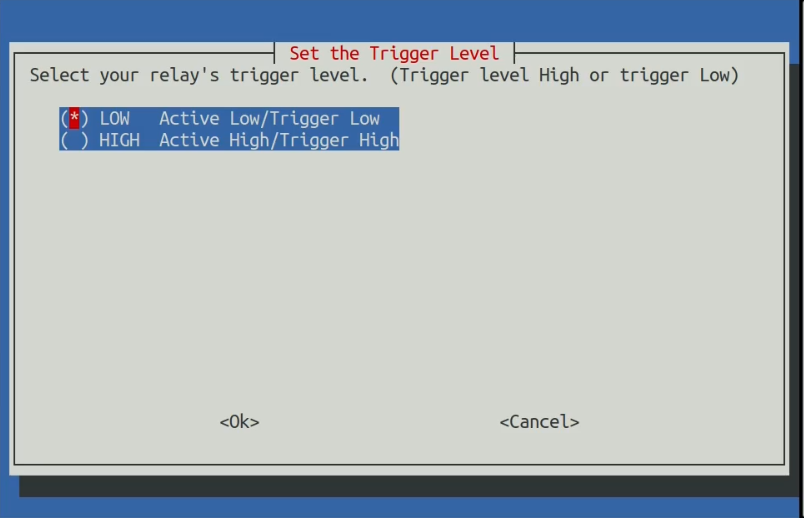
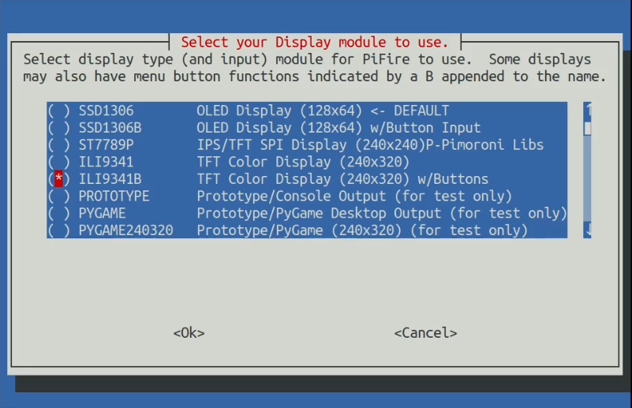
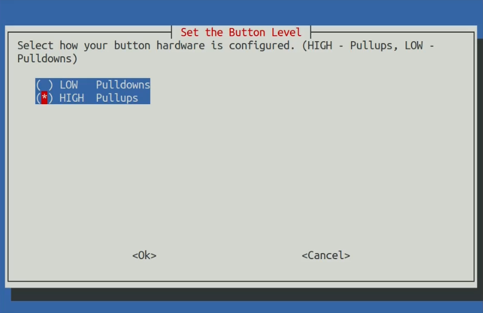

## Software Installation

### Basic Installation Video

Here's a video that goes through the basics of installation of PiFire:

[](https://youtu.be/4tRcG-pRTw4)

### Raspberry Pi Zero W (2) - Flash and Prepare SD Card

Once you've burned/etched the OS image (I prefer to the Raspberry Pi OS Lite) onto the microSD card, connect the SD card to your working PC and you'll see the card being mounted as "boot". Inside this "boot" directory, you need to make 2 new files. You can create the files using a text editor editor.

+ Step 1: Create an empty file. You can use Notepad on Windows or TextEdit to do so by creating a new file. Just name the file `ssh`. Save that empty file and dump it into boot partition (microSD).

+ Step 2: Create another file name wpa_supplicant.conf . This time you need to write a few lines of text for this file. For this file, you need to use the FULL VERSION of wpa_supplicant.conf. Meaning you must have the 3 lines of data namely country, ctrl_interface and update_config

```
country=US
ctrl_interface=DIR=/var/run/wpa_supplicant GROUP=netdev
update_config=1

network={
    ssid="your_real_wifi_ssid"
    scan_ssid=1
    psk="your_real_password"
    key_mgmt=WPA-PSK
}
```

### Power-On, Log In Via SSH and Run RasPi-Config

Now you can power-up your Raspberry Pi with your microSD card inserted, and connect to it via SSH.  If you're on a Linux PC, use the command line connect to your Pi.

```bash
$ ssh pi@192.168.10.xxx
```

If you're on a Windows PC, you can use Putty to SSH to your Pi, or you can install the Windows Subsystem for Linux and install a Linux image like Ubuntu to run the above command.  

Once connected, you'll want to run raspi-config to get the system setup.  

```bash
$ sudo raspi-config
```

Once raspi-config is open, the following should be configured at a minimum.

1. Set locales (Always good practice.  For US English, I typically use EN UTF8)

2. Set timezone (This ensures you have the right time in your dashboard)

3. Replace Hostname with a unique hostname ('i.e. pifire')

4. Optionally Enable I2C under Interfacing Options

	* Use the down arrow to select Interfacing Options
	* Arrow down to I2C
	* Select yes when it asks you to enable I2C
	* Also select yes when it asks about automatically loading the kernel module
	* Use the right arrow to select the 'finish' button

5. Finish and reboot

```tip
**i2c Fast Baudrate** (https://luma-oled.readthedocs.io/en/latest/hardware.html#pre-requisites) Optionally, to improve performance, increase the I2C baudrate from the default of 100KHz to 400KHz by altering `/boot/config.txt` to include:

`dtparam=i2c_arm=on,i2c_baudrate=400000`

**Notes for the Raspberry Pi 3B, 3B+ and Zero W** (https://www.abelectronics.co.uk/kb/article/1089/i2c--smbus-and-raspbian-stretch-linux)

The I2C controller on the Raspberry Pi 3B, 3B+ and Zero W has its clock linked to the VPU core so as the VPU frequency changes depending on processor load so does the clock rate of the I2C bus.  This can cause problems with any devices that expect a constant clock rate during communication.

To solve this issue the VPU core frequency must be set to a fixed frequency by editing /boot/config.txt.  Open the file with nano using the command:
`sudo nano /boot/config.txt`
Add the following text to the bottom of the file.

`core_freq=250`

Save your changes, exit the nano editor and reboot:

`sudo reboot`
```

```tip
It's also a great idea to run update/upgrade on intial setup.  The auto-install script does this for you as well, but will go faster if this has already been done.
```

### Automatic Software Installation

An automatic installation script has been provided to setup PiFire on freshly flashed Raspberry Pi.  Your mileage may vary, and if anything fails, you may just want to try re-running the installation again.  

```warning
This script requires that you install on the 'pi' user account, otherwise the supervisor portion of the install will likely fail.
```

After you've done the above steps to configure your raspberry pi, at the command line type the following (without the `$`):

```bash
$ curl https://raw.githubusercontent.com/nebhead/pifire/main/auto-install/install.sh | bash
```

OR you may find that it is more reliable to download the script to your raspberry pi first, and execute directly.

```bash
$ wget https://raw.githubusercontent.com/nebhead/pifire/main/auto-install/install.sh
$ bash install.sh
```

```note
Run the script without using SUDO, as the script will automatically obtain the privledges it needs to install.
```

Follow the onscreen prompts to complete the installation.  

```note
At the end of the script, the system reboot, so just be aware of this.
```

### Trigger Level for Relays

During the installation, you'll see a screen asking you to select that the trigger level should be for your relays.  Depending on the relays that you have selected for your build, you'll want to choose the right trigger level.  



```note
Many of the standard mechanical relay modules on the market will be active low.  However for Solid State Relays you may find that there are both active low and active high triggered relays available, so you'll want to make sure you check this and set this accordingly.
```

### Button Level for Physical Buttons

If you are using a display with physical button input, you'll be asked to select the button levels used in your setup.  



You have the option of selecting either HIGH (Pullups) or LOW (Pulldowns) for your buttons configuration.  Depending on how you wired up your buttons, you will want to select the right option.  If you manually built your own button board, using the example on the [hardware page](hardware) then you may want to select LOW.  If you used the button PCB designed by @weberbox, then you may want to set this to HIGH.  



## Changing Modules Later, After Installation

If you end up changing your PiFire configuration at some point down the line (like adding a pellet sensor, or changing the screen type), or even if you just want to fix a mistake you made during installation, you can go back and run the `modules.sh` script from SSH to reconfigure your module settings.  

First SSH to your PiFire (as described above), then run the following commands:

```bash
$ cd ~/pifire
$ sudo bash modules.sh
```

Then simply walk through the guided configuration menus until completed.  At the end of the configuration, you will need to reboot / restart PiFire for these changes to take effect.  
