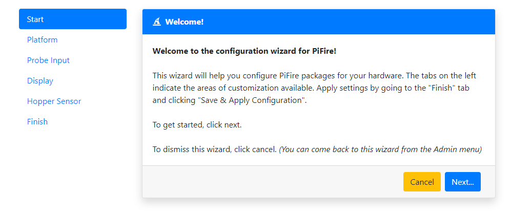
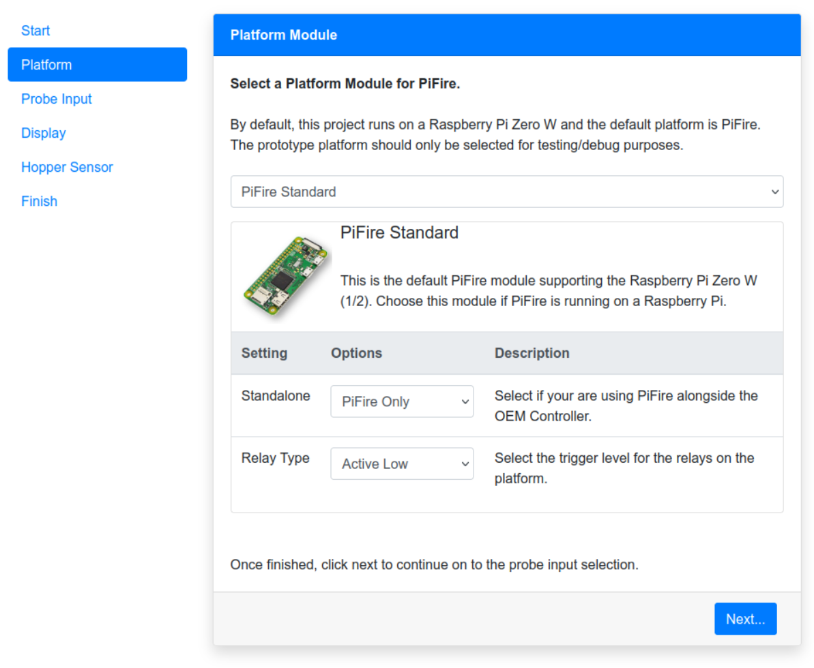
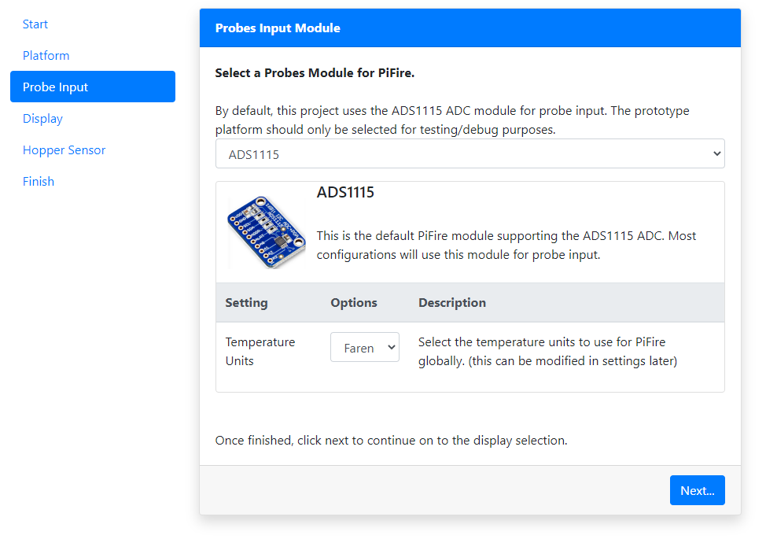
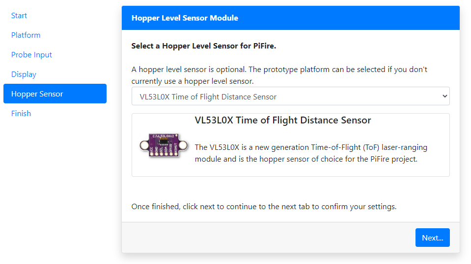
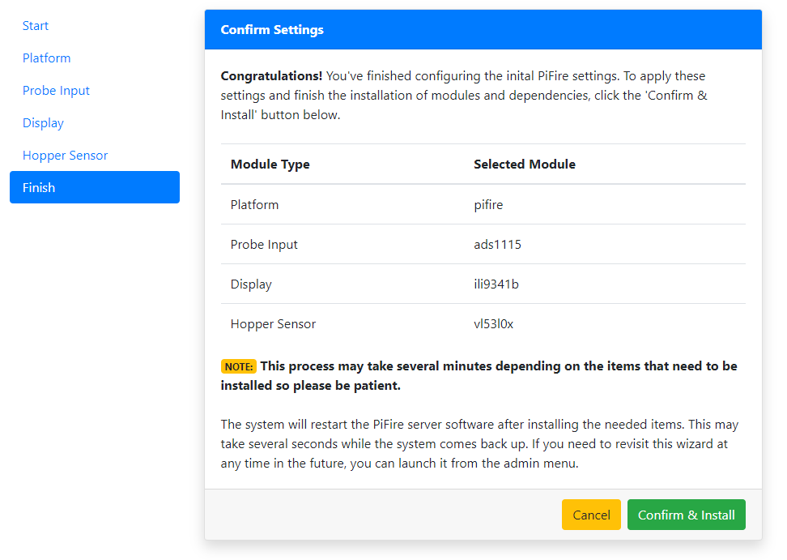
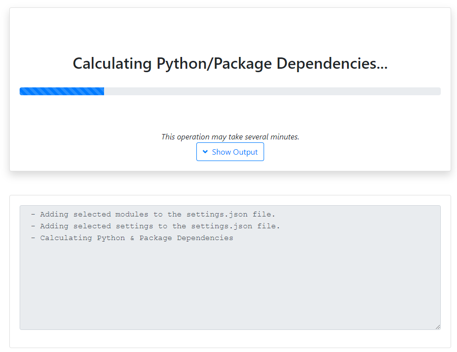
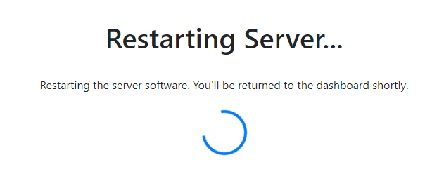
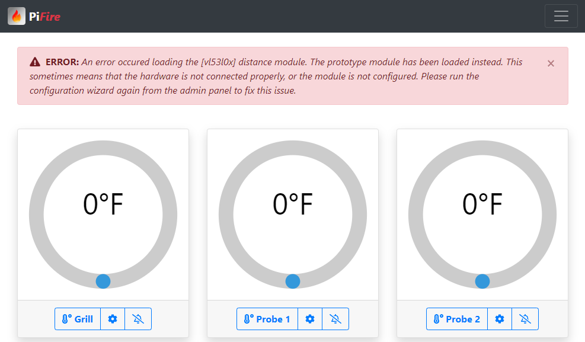

## Software Installation

### Basic Installation Video

It's recommended to watch the video and follow along with thes steps below, to get you up and running quickly.  

[](https://youtu.be/4tRcG-pRTw4)

### Raspberry Pi Zero W - Flash and Prepare SD Card

#### Recommended Method: Using the Raspberry Pi Imager (v1.7.x +)
With the updates to the Raspberry Pi Imager, you can quickly and easily configure and flash your SD Card in just minutes, all in one tool.

1. Open the Raspberry Pi Imager
2. Select the Raspberry Pi OS
	- Under Raspberry Pi OS (other), select the Raspberry Pi OS Lite (32-Bit)
3. Select the Storage Device (SD Card)
4. Select the 'Cog' icon in the lower right corner
	- Select Hostname (enter: pifire)
	- Select SSH (password authentication), and enter a password (keep username as 'pi')
	- Select Configure Wifi, and enter in your network SSID and password.  Also, select your Wifi country i.e. 'US' for the United States
	- Select Locale Settings, and configure your timezone and keyboard layout
	- Click Save
5. Select Write and wait for the imager to write to the SD Card


#### Manual Method: If not using the Raspberry Pi Imager

Once you've burned/etched the OS image (Raspberry Pi OS Lite 32-bit) onto the microSD card, connect the SD card to your working PC and you'll see the card being mounted as "boot". Inside this "boot" directory, you need to make 2 new files. You can create the files using a text editor editor.

+ Step 1: Create an empty file. You can use Notepad on Windows or TextEdit to do so by creating a new file. Just name the file `ssh`. Save that empty file and dump it into boot partition (microSD).

+ Step 2: Create another file name wpa_supplicant.conf . This time you need to write a few lines of text for this file. For this file, you need to use the FULL VERSION of wpa_supplicant.conf. Meaning you must have the 3 lines of data namely country, ctrl_interface and update_config

```
country=US
ctrl_interface=DIR=/var/run/wpa_supplicant GROUP=netdev
update_config=1

network={
    ssid="your_real_wifi_ssid"
    scan_ssid=1
    psk="your_real_password"
    key_mgmt=WPA-PSK
}
```

### Power-On, Log In Via SSH and Run RasPi-Config

Now you can power-up your Raspberry Pi with your microSD card inserted, and connect to it via SSH.  If you're on a Linux PC, use the command line connect to your Pi.

```bash
$ ssh pi@192.168.10.xxx
```

If you're on a Windows PC, you can use Putty to SSH to your Pi, or you can install the Windows Subsystem for Linux and install a Linux image like Ubuntu to run the above command.  

Once connected, you'll want to run raspi-config to get the system setup.  

```bash
$ sudo raspi-config
```

Once raspi-config is open, the following should be configured at a minimum.

1. Set locales (Always good practice.  For US English, I typically use EN UTF8)

2. Set timezone (This ensures you have the right time in your dashboard)

3. Replace Hostname with a unique hostname ('i.e. pifire')

4. Optionally Enable I2C under Interfacing Options

	* Use the down arrow to select Interfacing Options
	* Arrow down to I2C
	* Select yes when it asks you to enable I2C
	* Also select yes when it asks about automatically loading the kernel module
	* Use the right arrow to select the 'finish' button

5. Finish and reboot

```tip
**i2c Fast Baudrate** (https://luma-oled.readthedocs.io/en/latest/hardware.html#pre-requisites) Optionally, to improve performance, increase the I2C baudrate from the default of 100KHz to 400KHz by altering `/boot/config.txt` to include:

`dtparam=i2c_arm=on,i2c_baudrate=400000`

**Notes for the Raspberry Pi 3B, 3B+ and Zero W** (https://www.abelectronics.co.uk/kb/article/1089/i2c--smbus-and-raspbian-stretch-linux)

The I2C controller on the Raspberry Pi 3B, 3B+ and Zero W has its clock linked to the VPU core so as the VPU frequency changes depending on processor load so does the clock rate of the I2C bus.  This can cause problems with any devices that expect a constant clock rate during communication.

To solve this issue the VPU core frequency must be set to a fixed frequency by editing /boot/config.txt.  Open the file with nano using the command:
`sudo nano /boot/config.txt`
Add the following text to the bottom of the file.

`core_freq=250`

Save your changes, exit the nano editor and reboot:

`sudo reboot`

In some cases you might experience unexpected results with some I2C devices when increasing the frequency of the interface.  If your hardware seems to be having problems with the above, consider keeping the original baudrate for this bus. 
```

```tip
It's also a great idea to run update/upgrade on intial setup.  The auto-install script does this for you as well, but will go faster if this has already been done.
```

### Automatic PiFire Installation

An automatic installation script has been provided to setup PiFire on freshly flashed Raspberry Pi.  If anything fails, you may just want to try re-running the installation again.  

```warning
This script requires that you install on the 'pi' user account, otherwise the supervisor portion of the install will likely fail.
```

After you've done the above steps to configure your Raspberry Pi, at the command line type the following (without the `$`):

```bash
$ curl https://raw.githubusercontent.com/nebhead/pifire/main/auto-install/install.sh | bash
```

OR you may find that it is more reliable to download the script to your raspberry pi first, and execute directly.

```bash
$ wget https://raw.githubusercontent.com/nebhead/pifire/main/auto-install/install.sh
$ bash install.sh
```

```note
IMPORTANT: Run the script without using SUDO, as the script will automatically obtain the privledges it needs to install.
```

Follow the onscreen prompts to complete the installation.  

```note
At the end of the script, the system will reboot, so just be aware of this.
```

### PiFire Configuration Wizard

Once the initial installation script has run, the system will reboot and will be ready for the next step in the installation process, the configuration wizard.  

At this point you should be able to access the WebUI via a browser on your smart phone, tablet or PC device.  For the configuration step, it's recommended to complete this on your PC or tablet with a little more browser screen size. 

Simply navigate to the IP address of your device for example (you can usually find the IP address of your device from looking at your router's configuration/status pages). My router typically assigns IPs with prefixes of 192.168.10.XXX.  I'll use examples on my home network here, so you'll see URLs like: http://192.168.10.42  Yours may look different depending on your routers firmware/manufacturer (i.e. 10.10.0.XXX, etc.)
```note
**Note:** It's highly recommended to set a static IP for your Pi in your router's configuration.  This will vary from manufacturer to manufacturer and is not covered in this guide.  A static IP ensures that you will be able to access your device reliably, without having to check your router for a new IP every so often.   
```

#### Welcome to Configuration Wizard 

You should be presented with the configuration welcome, upon first boot after installation.  If you don't see this, you can always to go the 'Admin' screen and scroll down to PiFire Configuration Wizard and click the button to launch the wizard again.  



Click 'Next...' or on the Platform Pill to move to the next step.

#### Select the Platform 

By default, PiFire uses a Raspberry Pi Zero W and the default platform is called PiFire Standard.  If you are testing, you may select the Prototype platform, however for most all users, you should choose the PiFire standard platform.  



At the bottom of this section, you'll need to select that the trigger level should be used for your relays.  Depending on the relays that you have selected for your build, you'll want to choose the right trigger level.  

```note
Many of the standard mechanical relay modules on the market will be active low.  However for Solid State Relays you may find that there are both active low and active high triggered relays available, so you'll want to make sure you check this and set this accordingly.
```

#### Probe Input (ADC)

Next, you'll want to select the type of probe input you are using.  Most installations will be using the ADS1115 ADC for probe input.  



At the bottom of this section, you have the opportunity to select the temperature units in either Farenheit or Celcius.  Select whichever units you intend to use for this platform.  This can also be changed in the settings at a later time.  

#### Display & Button Input

The next section provides different display options that can be used.  By default, the ILI93441 SPI Display with Buttons input is selected.  However, there are several other options with and without button inputs that can be used.  Note that if you intend to use PiFire without a display, you can select the Prototype Module.


If you are using a display with physical button input, you'll be asked to select the button levels used in your setup.  

You have the option of selecting either Pullups (HIGH) or Pulldowns (LOW) for your buttons configuration.  Depending on how you wired up your buttons, you will want to select the right option.  If you manually built your own button board, using the example on the [hardware page](hardware) then you may want to select Pulldowns.  If you used the button PCB designed by @weberbox, then you may want to set this to Pullups.  

#### Hopper Sensor

The last configuration section is the Hopper Sensor selection.  If you have a hopper level sensor installed, select the one that you are using in this section.  The best known working/recommended device is the VL53L0X Time of Flight sensor.  If you do not have a Hopper Sensor installed, select prototype.  



#### Finishing Up

Before running the final configuration/installation step confirm your selected modules.  



Once you have confirmed these settings, you can click the 'Confirm & Install' button to kick off the configuration/installation script.  



This step may take several minutes as it goes through the installation of any Python or System dependencies that may be required.  Clicking on the Show Output button should show the status as the installation completes.  



Finally, PiFire will restart it's software and redirect to the Dashboard when it is ready.  

#### Oh no!  Something went wrong! 

If PiFire ran into any issues loading modules, you may see an error message like the following:



Check that yout module that you were attempting to load is the correct module or that the hardware is correctly installed for your system.  If all else fails, you may need to repeat the installation process from the beginning.  

## Changing Modules Later, After Installation

If you end up changing your PiFire configuration at some point down the line (like adding a pellet sensor, or changing the screen type), or even if you just want to fix a mistake you made during installation, you can go back and run wizard again by launching it from the Admin page.  
